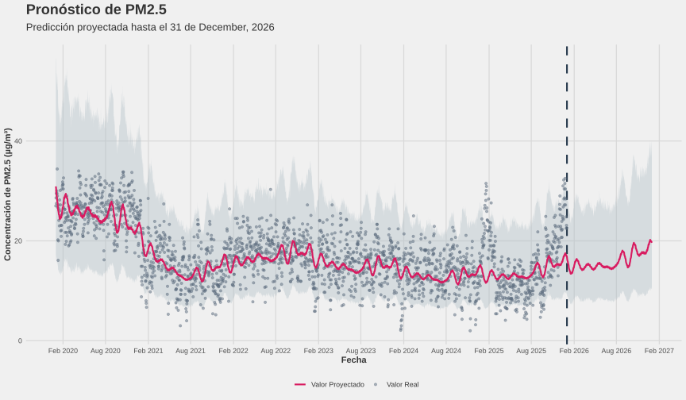

<div align="center">

# Pronóstico de Calidad del Aire ($PM_{2.5}$) con Prophet

[](https://www.r-project.org/)
[](https://facebook.github.io/prophet/)
[](LICENSE)

*Un pipeline automatizado en R para modelado, validación cruzada y pronóstico de $PM_{2.5}$ listo para publicaciones científicas.*

<br />



</div>

---

## 🌟 Características Principales

* **Log-Transformación Pura ($\log(y)$):** Evita de forma rigurosa las predicciones negativas sin distorsionar los datos con constantes arbitrarias.
* **Validación Cruzada en Paralelo:** Búsqueda en cuadrícula (*Grid Search*) acelerada mediante procesamiento multinúcleo con barra de progreso interactiva.
* **Evaluación Fuera de Muestra (OOS):** División estricta entre entrenamiento y prueba (*Hold-out set*) para estimar métricas reales de desempeño ($RMSE$ y $MAE$).
* **Gráficos Estilo Periodístico/Académico:** Generación automática de gráficos vectoriales (`.svg`) estilizados con inspiración en *FiveThirtyEight*.

---

## 📁 Estructura del Proyecto

```text
.
├── PM2.5_prediccion.svg   # Imagen/Preview principal para el README
├── pm2.5_predict.R        # Script principal ejecutable (R CLI)
├── justfile               # Automatización de tareas (Just task runner)
├── LICENSE                # Licencia MIT
├── TJaire.Rproj           # Proyecto de RStudio
├── datos/
│   └── Tijuana.tsv        # Datos de entrada (ejemplo)
└── resultados/            # Archivos y gráficas generadas automáticamente
    ├── PM2.5_modelo.Rds
    ├── PM2.5_hparams.tsv
    ├── PM2.5_tabla_cv.tsv
    ├── PM2.5_prediccion.svg
    ├── PM2.5_componentes.svg
    ├── PM2.5_prod_residuales.svg
    ├── PM2.5_cvmetricas.svg
    ├── PM2.5_oos_dispersion.svg
    ├── PM2.5_oos_residuales.svg
    └── PM2.5_oos_dist_error.svg